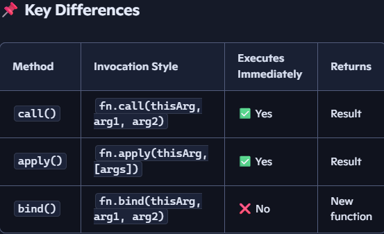

### call(), apply(), and bind() 

1. Difference between var and let keyword in javascript.
2. Is javascript a statically typed or a dynamically typed language?
3. Explain call(), apply() and, bind() methods.
   - are methods that set the this context of a function and optionally pass arguments.
   - All three are used to explicitly set the this value inside a function.
    - They allow method borrowing and function reuse across objects.
    - call(): When you want to invoke a function with a specific this and individual arguments.
    - apply(): When arguments are in an array (e.g., spreading or variadic functions).
    - bind(): When you want to create a new function with a fixed this for later use (e.g., event handlers, callbacks).

  
4. What is the distinction between client-side and server-side JavaScript?
5. Explain $(document).ready() function?
   - $(document).ready() ensures that your jQuery code runs only after the DOM is fully loaded.
6. What is the purpose of JQuery's delay() method?
   - delay() pauses the execution of queued jQuery effects for a specified duration.
   - $(selector).delay(duration);

7. between Finalize() and Dispose() methods?
   - Dispose() is for explicit garbage cleanup by the developer.
   - Finalize() is for implicit cleanup by the garbage collector.
   - Always prefer Dispose() for deterministic cleanup (e.g., file handles, DB connections).
   - Use Finalize() only as a safety net for unmanaged resources.

8. Describe jQuery Connect in brief. Also, list its uses.
   - jQuery Connect is a plugin that allows you to link one function to another so that when the first function executes, the connected function runs automatically afterward.
9. React -What is JSX?
   - JSX (JavaScript XML) is a syntax extension for JavaScript used in React to describe UI elements in a way that looks like HTML. It makes writing and visualizing component structure intuitive and expressive.   
10. Explain React Hooks.  ? 
    -   Hooks bring stateful logic and side effects to functional components, making them as powerful as class components.
    -   Common Built-in React Hooks
    - useState() – Adds local state to functional components.

    -  useEffect() – Handles side effects like data fetching, subscriptions, and DOM updates.

    -  useContext() – Accesses context values without nesting <Context.Consumer>.

    -  useRef() – Persists values across renders without triggering re-renders; useful for DOM refs.

    -  useMemo() – Memoizes expensive computations to avoid recalculating on every render.

    -  useCallback() – Memoizes functions to prevent unnecessary re-renders of child components.

    -  useReducer() – Manages complex state logic using a reducer pattern (Redux-like).

    -  useLayoutEffect() – Like useEffect, but fires synchronously after DOM mutations.

    -  useImperativeHandle() – Customizes the instance value exposed to parent via ref
11.  Explain Strict Mode in React.

12. How to iterate/loop through all p elements in jquery
$("p").each(function() { 
   console.log( $(this).attr('id')); 
});

13. What are Collections in C# and what are their types?
    - Why Use Collections?
Arrays are fixed-size and type-specific.

Collections offer dynamic sizing, rich APIs, and flexible data structures.

🧰 Types of Collections in C#
1. Non-Generic Collections (in System.Collections)
Store objects as object type (boxing/unboxing overhead).

Examples:

ArrayList – dynamic array of objects

Hashtable – key-value pairs (non-generic)

Stack – LIFO collection

Queue – FIFO collection

2. Generic Collections (in System.Collections.Generic)
### 🧰 Types of Collections in C#

#### 1. Non-Generic Collections (`System.Collections`)
- Store objects as `object` type (boxing/unboxing overhead).
- Examples:
  - `ArrayList` – dynamic array of objects
  - `Hashtable` – key-value pairs (non-generic)
  - `Stack` – LIFO collection
  - `Queue` – FIFO collection

#### 2. Generic Collections (`System.Collections.Generic`)
- Type-safe, performant, and preferred in modern C#.
- Examples:
  - `List<T>` – dynamic array of type `T`
  - `Dictionary<TKey, TValue>` – key-value pairs
  - `HashSet<T>` – unique unordered elements
  - `Queue<T>`, `Stack<T>` – generic FIFO/LIFO

#### 3. Concurrent Collections (`System.Collections.Concurrent`)
- Thread-safe collections for multi-threaded scenarios.
- Examples:
  - `ConcurrentDictionary<TKey, TValue>`
  - `ConcurrentQueue<T>`, `ConcurrentStack<T>`
  - `BlockingCollection<T>`

#### 4. Specialized Collections (`System.Collections.Specialized`)
- Tailored for specific use cases.
- Examples:
  - `NameValueCollection`
  - `StringCollection`
  - `BitVector32`
---
14. DML  AND DDL Query
    ### 1. DDL – Data Definition Language
Used to define and modify the structure of database objects.

- `CREATE` – Create new tables, views, indexes, etc.
- `ALTER` – Modify existing database objects
- `DROP` – Delete objects from the database
- `TRUNCATE` – Remove all records from a table (faster than DELETE)

### 2. DML – Data Manipulation Language
Used to manipulate data stored in tables.

- `SELECT` – Retrieve data
- `INSERT` – Add new records
- `UPDATE` – Modify existing records
- `DELETE` – Remove records

### 3. DCL – Data Control Language
Used to control access to data in the database.

- `GRANT` – Give user access privileges
- `REVOKE` – Remove user access privileges

### 4. TCL – Transaction Control Language
Used to manage transactions in a database.

- `COMMIT` – Save changes permanently
- `ROLLBACK` – Undo changes
- `SAVEPOINT` – Set a point to rollback to
- `SET TRANSACTION` – Define transaction properties

### 5. DQL – Data Query Language
Focused solely on querying data.

- `SELECT` – The only DQL command, used to fetch data from a database
 --- 
15. How to delete duplicate rows in SQL Server?
16. How to optimize a Stored Procedure or SQL Query?
    - Use indexing, selective queries, and efficient joins to reduce execution time and resource usage.
17. 4 Pillar OOPS
18. What is GAC?
19. How to create GAC?
20. interface members are implicitly abstract and public
21. What is Reflection?
22. What is an Assembly? What are the different types of assembly in .NET?
23. What are Collections in C# and what are their types?
24. What is IEnumerable in C#?
25. What is the purpose of “params” keyword?
26. What are Anonymous Delegates in C#?
27. What is the purpose of “using” keyword in C#?
28. What is Boxing and Unboxing?
29. What are Generations in garbage collection?
30. WHY DO WE USE DELEGATE?
31. Can you create an instance of an Abstract class or an Interface?
32. between static constructor and normal constructor in C#
33. between Finalize() and Dispose() methods?
34. Difference between string and string builder
35. What are sealed keyword in C#?
36. diff between finally and finalize block?
37. ReadOnly and constant
38. difference between an abstract class and an interface?
39. managed and unmanage code not able to explain
40. Why are strings in c# immutable?
41. What are extension methods in C#?
42. Early binding and late binding
43. Solid-principle
44. private class in a namespace?-
45. How to use nullable types in .Net?
46. What are the types of classes in C#?
47. data encapsulation - dont have idea
48. Difference between var and dynamic keyword 
49. Differences Between As and Is
50. IEnumerator and IEnumerable
51. IComparable, IComparer 
52. How can you Prevent a method from being overridden
53. difference between Dictionary and Hashtable
54. Does C# Allow Static Methods to Implement an Interface?-don't have an idea
55. Solid-principle
56. composit primary key
57. temporary table
58. UNION & UNION ALL
59. What is the difference between COMMIT and ROLLBACK?
60. What is the difference between varchar and nvarchar types?
61. How to delete duplicate rows in SQL Server?
62. How to optimize a Stored Procedure or SQL Query?
63. What Is Cascade delete/update?-couldn't ans
64. What is the difference between DROP and TRUNCATE?
65. What is CTE in SQL Server?
66. Scalar function and table value function
67. index 
68. What is a Constraint is SQL? What are its types.
69. UPSERT-couldn't ans
70. INNER JOIN,CROSS JOIN
71. What's the difference between RANK() and DENSE_RANK 
72. Explain concept of the clustering in SQL and practical use
73. What is the difference between BETWEEN and IN operators in SQL
74. Types of SQL subqueries
75. How to get the Nth highest salary of an employee?
76. What are a Scheduled Jobs?
77. Where and Having Clause - average
78. What are ACID properties?
79. What are Magic Tables in SQL Server?-couldn't ans
80. What are triggers?
81. Can we add an identity column to the decimal datatype?
82. Why should we use Ajax in our application?
83. What are the different modes for the Session state in ASP.NET?
84. List types of Caching.
85. What is the role of Postback in ASP.NET?average
86. Where the viewstate is stored after the page postback?
87. Explain the difference between custom controls and user controls.
88. view state and session
89. Types of cookies
90. Use of Global.asax file tell me event 
91. What is ListView and how is it different from GridView 
92. different execute() methods available in ADO.NET? 
93. How to define a connection string in the Web.config file?
94. types MVC routing concept
95. What are the different return types of a controller Action method?
96. When Should I Use Partial Views
97. How can we Call/Display Partial View?
98. What are Areas in MVC?
99.  How Validation works in MVC ? What is Data Annotation ?
100. view data and view bag
101. What is the importance of NonActionAttribute?-couldn't ans
102. What is the use of Keep and Peek in “TempData”?
103. Can you explain RenderBody and RenderPage in MVC?
104. What is the sequence in which filters get executed?
105. Have you created any custom Action Filter?
106. @Html.Partial and @Html.RenderPartial 
107. Make a differentiation between View and Partial View?
108. ActionResult and ViewResult
109. What is Minification and Bundling?
110. What is the startup class in ASP.NET core
111. What is Run(), Use() and Map() method?
112. What is Metapackage? Name of Metapackage provided by ASP.NET Core?
113. hat is Kestrel? What is the difference between Kestrel and IIS?
114. How to use Dependency Injection in Views in ASP.NET Core?
115. What is difference between middleware and filters in .NET Core?
116. Dependency Injection
117. What are some pros and cons of using constructor injection over other approaches?
118. Describe the Service Lifetimes
119. What are the ASP.NET Core Middleware Components?
120. Roles of Appsettings.Json and Launchsetting.Json file in ASP.NET Core ?
121. UseRouting: Matches request to an endpoint.
122. UseEndpoints: Execute the matched endpoint.
123. What are the various techniques to save configuration settings in .NET Core
124. What is CORS? Why CORS restriction is required? Hot to fix CORS error?
125. What is In-Memory caching & Distributed Caching? When to use what?
126. What are Request Delegates in ASP.NET Core?
127. Explain how logging works in Asp.Net Core?
128. What are Razor pages in .NET Core?
129. What is XSRF or CSRF? How to prevent Cross-Site Request Forgery
130. What are main return types supported in Web API?
131. Explain error handling in Web API.-fair
132. How can you configure JWT authentication in ASP.NET Core Web API?
133. To configure JWT authentication in ASP.NET Core Web API with top-level statements, modify the Program.cs file as follows:
134. How can you generate a JWT token in ASP.NET Core Web API?
135. Web API supports which protocol?
136. How to register exception filter globally?
137. What is Web API? What is the purpose of Web API?
138. What is an HTTP header?
139. What is the difference Rest API and Web API?
140. What is the difference between IActionResult and IHttpActionResult ?
141. What are REST guidelines? What is the difference between Rest and Restful?
142. What are the types of authentication techniques in web API?
143. How can we handle errors in Web API?
144. How to consume Web API from a .NET MVC application?
145. How do we make sure that Web API returns data in JSON format only?
146. config.Formatters.JsonFormatter.SupportedMediaTypes.Add(new MediaTypeHeaderValue(“application/json”))
147. jwt
148. What is Content Negotiation in Web API?
149. What is MediaTypeFormatter class in Web API?
150. What are Response Codes in Web API?
151. Lazy loading -couldn't ans
152. is string interpolation in Angular?
153. What are directives in Angular?
154. What is an AOT(ahead-of-time) compilation? What are its advantages?
155. What is the difference between JIT and AOT in Angular ?
156. Explain the @Component Decorator.
157. What are Services in Angular? 
158. What is CLI tool ?
159. Where to store static files in Angular project ?
160. What is Data Binding in Angular?
161. What is Property Binding in Angular?
162. What is the difference between Template Driven Forms & Reactive Forms ?
163. What is a Selector and Template?
164. What is Two way Binding in Angular?
165. How to create Servicein Angular?