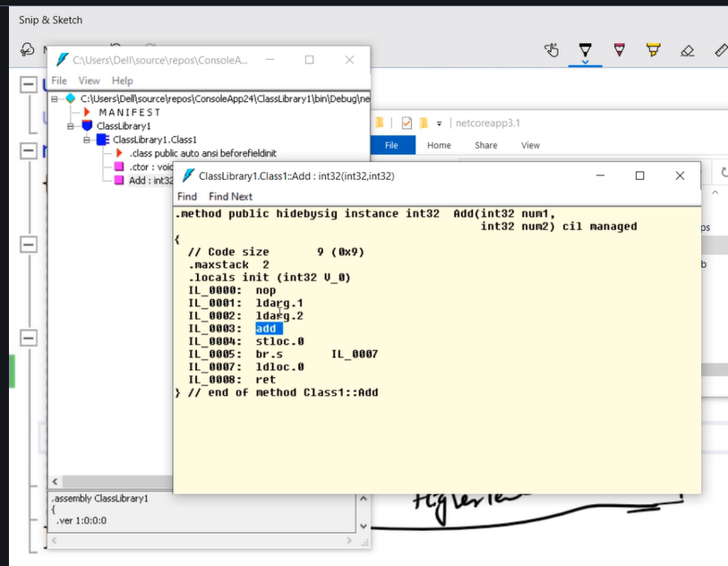

## Abstract vs Interface
Interfaces are Implemented, Abstract classes are inherited.
Abstract is a half defined parent/base class.

# Interface Segregation
You create Different different methods so the clients to use unnecessary methods.

# Interface is Contract
- Everything in Interface is public, We cannot Define as well
- Interface is a contract, by having a contract between creator and consumer we have better change management, better impact analysis control and better control on breaking changes.
- Supports Multiple Inheritance

# VIRTUAL & ABSTRACT & OVERRIDE
- Abstract class & Abstract method Are VIRTUAL in behavour.
- We cannot create instance of abstract class.
- Its compulsary to implement abstract methods in child class.
  

# OOPS
1. Abstration - Show only what is necessary (public, private, protected).
   - Happens during design phase.
2. Encapsulation - Hide complexity.
   - Happens during execution phase.
   - Encapsulation executes abstraction. 
3. Inheritance (is a relationship)- Parent Child Relationship .
4. Polymorphism - Object can act differnt under different conditions.

## Class
  Is a blueprint for the object.

# Events Vs Delegates
## Events - Events uses Delegates internally.
Delegates are for Callbacks, Not Encapsulated, can be easily manipulated.  
Events are Encapsulation over Delegates.  
Events are Observable Observer Model, Encapsulated.
## Delegates - Pass method as parameter.
- Delegate is a pointer to a function.
- Delegate are callbacks which helps to communicate between async and parallel execution.
- Delegates are **type-safe**, meaning the method signature must match the delegate declaration.
- A **delegate** is a type that holds a reference to a method with a specific signature.
- It enables **methods to be treated as variables**—passed as parameters, stored, and invoked dynamically.

---

## 🔹 Why Use Delegates?
- For **callbacks** and **event handling**.
- To write **flexible, reusable code** where behavior is passed as a parameter.
- To support **functional-style programming** with LINQ and lambdas.

```csharp
public class MainClass
{
    // Delegate declaration
    delegate int Calculate(int a, int b);

    static void Main(string[] args)
    {
        // Assign Add method to delegate
        Calculate objSum = new Calculate(Add);
        int sum = objSum(10, 5);

        // Assign Sub method to delegate
        Calculate objDiff = new Calculate(Sub);
        int diff = objDiff(10, 5);

        Console.WriteLine($"Sum: {sum}");
        Console.WriteLine($"Difference: {diff}");
    }

    private static int Add(int x, int y)
    {
        return x + y;
    }

    private static int Sub(int x, int y)
    {
        return x - y;
    }
}
```

## `out` Keyword in C#

## 🔹 What is `out`?
- It allows a method to **return multiple values** without using return types like tuples or custom classes.
- The `out` keyword in C# is used to **pass arguments by reference** to a method.
- The variable passed as `out` must be assigned inside the method before it is returned.


## 🔹 Key Points
- **Must be initialized inside the method** before returning.
- **Caller does not need to initialize** the variable before passing it.
- Often used in **Try-Parse patterns** (e.g., `int.TryParse`).
- Similar to `ref`, but `ref` requires the variable to be initialized before passing.

---

## 🔹 Example: Returning Multiple Values

```csharp
static void Main(string[] args)
{
    int add = 0;
    int sub = 0;
    MyMaths(10, 10, out add, out sub);
}

static void MyMaths(int num1, int num2,
                    out int add,
                    out int sub)
{
    add = num1 + num2;
    sub = num1 - num2;
}

```

## ⚠️ Exception Handling

## 🔹 What is Exception Handling?
- **Exception handling** is the process of responding to runtime errors in a controlled way.
- In C#, exceptions are objects derived from `System.Exception`.
- The goal is to prevent program crashes and provide meaningful error recovery.

---

## 🔹 Keywords

| Keyword     | Purpose                                                                 |
|-------------|-------------------------------------------------------------------------|
| `try`       | Defines a block of code to monitor for exceptions.                      |
| `catch`     | Handles exceptions thrown in the `try` block.                           |
| `finally`   | Defines a block of code that always executes (cleanup, closing files).  |
| `throw`     | Used to explicitly raise an exception.                                  |

---

## 🔹 Basic Example

```csharp
using System;

class Program {
    static void Main() {
        try {
            int[] numbers = {1, 2, 3};
            Console.WriteLine(numbers[5]); // Index out of range
        }
        catch (IndexOutOfRangeException ex) {
            Console.WriteLine($"Error: {ex.Message}");
        }
        finally {
            Console.WriteLine("Execution finished.");
        }
    }
}
```

## TPL Task

# ⚔️ Thread vs Task (TPL) in C#

## 🔹 Overview

| Feature            | `Thread` (System.Threading)                          | `Task` (System.Threading.Tasks)                          |
|--------------------|------------------------------------------------------|----------------------------------------------------------|
| **Level**          | Low-level                                            | High-level abstraction                                   |
| **Creation**       | Manual (`new Thread(...)`)                          | Lightweight (`Task.Run(...)`, `async/await`)             |
| **Thread Pool**    | Not used by default                                  | Uses thread pool efficiently                             |
| **Scalability**    | Limited; manual management                           | Highly scalable; managed by TPL                          |
| **Exception Handling** | Manual try/catch                                 | Built-in support with `await` and `ContinueWith()`       |
| **Return Values**  | No return value                                      | Supports return values via `Task<T>`                     |
| **Cancellation**   | Manual (complex)                                     | Built-in support via `CancellationToken`                |
| **Continuations**  | Manual chaining                                      | Easy chaining with `.ContinueWith()` or `await`         |
| **Use Case**       | Fine-grained control, legacy code                    | Modern async/parallel operations                         |

---

## 🔹 Thread Example

```csharp
using System;
using System.Threading;

class Program {
    static void Main() {
        Thread t = new Thread(() => {
            Console.WriteLine("Running in thread...");
        });
        t.Start();

        Console.WriteLine("Main thread continues...");
    }
}


## Threading
- **Threading** allows a program to perform multiple tasks concurrently.
- A **thread** is the smallest unit of execution within a process.
- In C#, threading is managed through the `System.Threading` namespace.

---

## Why Use Threads?
- Improve application responsiveness (e.g., UI remains active while background tasks run).
- Perform parallel operations (e.g., downloading files, processing data).
- Utilize multi-core processors efficiently.


| Concept              | Description                                                                 |
|----------------------|-----------------------------------------------------------------------------|
| **Thread**           | Represents an independent path of execution.                               |
| **Main Thread**      | The default thread where program execution starts.                         |
| **Worker Thread**    | Additional threads created to perform background tasks.                    |
| **Thread Pool**      | A pool of reusable worker threads managed by .NET for efficiency.          |
| **Task Parallel Library (TPL)** | High-level abstraction for managing parallel tasks.                  |
| **Async/Await**      | Simplifies asynchronous programming by avoiding manual thread management.  |

---

```csharp
using System.Threading;
using System.Collections;

namespace ConsoleApp44
{
    class Program
    {
        static void Main(string[] args)
        {
            Thread t = new Thread(Method1);
            t.Start();

            Thread t1 = new Thread(Method2);
            t1.Start();

            Console.Read();
        }

        static void Method1()
        {
            // Your logic here
        }

        static void Method2()
        {
            // Your logic here
        }
    }
}
```


## 📘 Generic Collections in C#

- Generic collections are type-safe, resizable data structures in the `System.Collections.Generic` namespace.
- They store elements of a specific type defined at compile time.
- Unlike non-generic collections (like `ArrayList`), they avoid boxing/unboxing and casting.

---

## 🔹 Advantages
- **Type Safety**: Prevents adding invalid types.
- **Performance**: No boxing/unboxing for value types.
- **Flexibility**: Automatically resizes as elements are added/removed.
- **LINQ Support**: Works seamlessly with LINQ queries.
- **Cleaner Code**: No need for casting when retrieving elements.

---

## 🔹 Common Generic Collections

| Collection              | Description                                                                 | Example Usage |
|-------------------------|-----------------------------------------------------------------------------|---------------|
| **List<T>**             | Dynamic array; maintains order; supports indexing, searching, sorting.      | `List<int> nums = new List<int>();` |
| **Dictionary<TKey,TValue>** | Key-value pairs; fast lookups by key.                                      | `Dictionary<int,string> dict = new();` |
| **Queue<T>**            | FIFO (First-In-First-Out) collection.                                       | `Queue<string> q = new Queue<string>();` |
| **Stack<T>**            | LIFO (Last-In-First-Out) collection.                                       | `Stack<double> s = new Stack<double>();` |
| **SortedList<TKey,TValue>** | Maintains elements sorted by key.                                          | `SortedList<int,string> sl = new();` |
| **HashSet<T>**          | Stores unique elements; no duplicates.                                     | `HashSet<string> hs = new();` |
| **LinkedList<T>**       | Doubly linked list; efficient insertions/deletions.                        | `LinkedList<int> ll = new();` |

---

## 🔹 Example

```csharp
using System;
using System.Collections.Generic;

class Program {
    static void Main() {
        // List<T>
        List<string> names = new List<string>();
        names.Add("Alice");
        names.Add("Bob");
        Console.WriteLine(names[0]); // Alice

        // Dictionary<TKey, TValue>
        Dictionary<int, string> dict = new Dictionary<int, string>();
        dict.Add(1, "One");
        dict.Add(2, "Two");
        Console.WriteLine(dict[2]); // Two
    }
}
```

## Array vs ArrayList
- **Array**: Fixed-size collection of elements of the same type.  
- **ArrayList**: A non-generic, resizable collection class in `System.Collections` that stores objects.

---

## 🔹 Key Differences

| Aspect              | Array                                                                 | ArrayList                                                                 |
|---------------------|----------------------------------------------------------------------|---------------------------------------------------------------------------|
| **Size**            | Fixed once created; cannot be changed.                               | Dynamic; grows or shrinks automatically.                                  |
| **Type of Elements**| Strongly typed (all elements must be of the same type).              | Stores `object`; allows mixed types but requires boxing/unboxing for primitives. |
| **Performance**     | Faster for indexed access due to contiguous memory allocation.       | Slower when storing/retrieving primitives due to boxing/unboxing overhead. |
| **Methods**         | Limited (e.g., `Length`, `CopyTo`).                                  | Rich set of methods (`Add()`, `Remove()`, `Insert()`, `Contains()`, etc.).|
| **Length/Size**     | Use `.Length` property.                                              | Use `.Count` property.                                                     |
| **Iteration**       | `for`, `foreach`, LINQ.                                              | `foreach`, LINQ, plus collection methods.                                 |
| **Dimensionality**  | Can be single or multi-dimensional.                                  | Only single-dimensional.                                                   |
| **Flexibility**     | Less flexible; must know size in advance.                            | More flexible; adjusts size as needed.                                    |

---

## 🔹 Example

```csharp
// Array Example
int[] numbers = new int[3];
numbers[0] = 10;
numbers[1] = 20;
numbers[2] = 30;

// ArrayList Example
using System.Collections;

ArrayList list = new ArrayList();
list.Add(10);       // int boxed to object
list.Add("Hello");  // string stored as object
list.Add(3.14);     // double boxed to object
```

## CASTING - Implicit vs Explicit

### 🔹 Implicit Casting (Type Conversion)
Automatic type conversion performed by the compiler when there is no risk of data loss.
- **Key Point:** Smaller → larger type (safe conversion).
- **Example:**
```csharp
int num = 100;       // int (32-bit)
double d = num;      // implicit casting: int → double
Console.WriteLine(d); // prints 100
```

## 🔹 Explicit Casting

**Definition:**  
Manual type conversion using a cast operator or conversion methods.

**Example:**
```csharp
double d = 9.78;     
int num = (int)d;    // explicit casting: double → int
Console.WriteLine(num); // prints 9 (fractional part lost)
```

## 🥊BOXING UNBOXING
Boxing and unboxing are mechanisms to convert between value types (like int, struct) and reference types (object).
-> Have huge performance impact due to frequent boxing unboxing.
```csharp
Boxing
int num = 42;          // value type
object obj = num;      // boxing: int → object
Console.WriteLine(obj); // prints 42

UNBOXING
object obj = 42;       // boxed int
int num = (int)obj;    // unboxing: object → int
Console.WriteLine(num); // prints 42

```


## HEAP vs STACK
STACK - Stores Primitive Data Types, Variable, Data, Memory location are at same location.
HEAP - Stores Object with pointer

## Garbage Collector
Is a background process, And Cleans any **Unused & Managed Resources.**

### IL Code - Intermediate Language Code, Partially Compiled  Code.  
### JIT - Just In Time compiler - Converts IL code to Machine Code.



IL Example
# C# vs .Net Framwework
### C# - Programming Language Features (Syntaxes, Symentics, Loops, If Else)
### .NET - Framework Features such as [ Common Language Runtime (CLR), Liabraries, Garbage Collector. ]

<details>
  <summary>1. Compilation and Execution</summary>

  When we write a C# program, it gets compiled into Intermediate Language (IL) code, which is platform-independent.  
  The CLR then uses a Just-In-Time (JIT) compiler to convert the IL code into machine-specific code while the program runs.

</details>

<details>
  <summary>2. Services Provided by CLR</summary>

  - CLR handles automatic memory management through Garbage Collection, preventing memory leaks.  
  - It ensures that data types are used correctly and safely.  
  - The CLR checks the IL code for security risks before running it.

</details>

<details>
  <summary>3. Cross-Language Integration</summary>

  CLR allows code from different .NET languages (C#, VB.NET, F#) to work together seamlessly through the Common Type System (CTS).

</details>

<details>
  <summary>Key Components of CLR</summary>

  - **Common Language Specification (CLS):** Defines common rules so that code written in different languages can interoperate.  
    - *Managed Code:* The MSIL code which is managed by the CLR is known as the Managed Code. For managed code CLR provides three .NET facilities.  
    - *Unmanaged Code:* Before .NET development, programming languages like COM Components & Win32 API do not generate MSIL code. These are not managed by CLR but by the Operating System.

  - **JIT Compiler:** Converts IL code into machine code specific to the system at runtime, optimizing execution.  
  - **Garbage Collector:** Automatically manages memory by freeing unused objects, reducing the need for manual memory management.  

  - **Common Type System (CTS):** Ensures that different data types across languages are understood by CLR and can work together.  
    - *Value Types:* Store the value directly into the memory location. These types work with stack mechanisms only. CLR allocates memory at compile time.  
    - *Reference Types:* Contain a memory address of value because reference types don’t store the variable value directly in memory. These types work with heap mechanism. CLR allocates memory at runtime.

</details>


